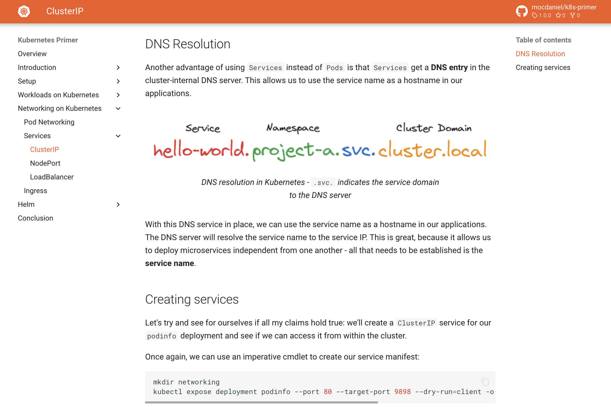

# K8s-Primer

This repository contains the materials for an introductory workshop about Kubernetes.

The workshop guides participants through **setting up** a **local Kubernetes lab** consisting of three nodes using:

- Docker
- KinD
- kubectl
- ingress-nginx
- Helm

It will then cover the following topics, including hands-on lab sessions for participants to do on their local clusters:

- Introduction to Kubernetes and its architecture
- Workload management on Kubernetes
- Network management on Kubernetes
- Using Helm for deploying workloads to Kubernetes

Over time, more topics might get added to the workshop.

