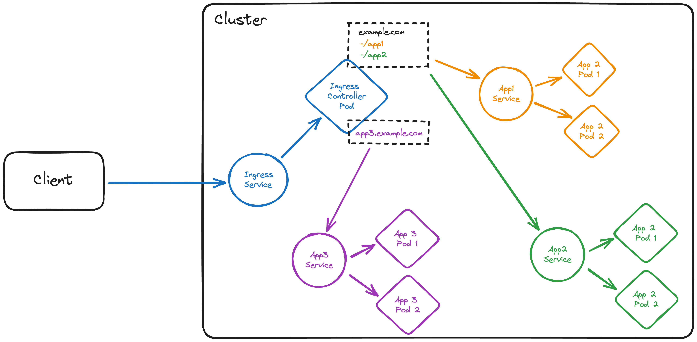

# Ingress

We have learned about the different types of `Services` that Kubernetes provides. However, all of those services are **exposed** via a **single IP address**. This means that we can't use them to **expose multiple services** to the outside world. Imagine running **multiple** web applications in our cluster - we would need to **expose** them **all** on **different ports**.

This would lead to one of two unwanted scenarios:

- we would need a **load balancer per service** to route traffic to the correct port (cloud load balancers are **expensive!**)
- we would need to **expose** the **services** on **different ports** and **keep track** of which service is exposed on which port, and so would our clients

None of these 'solutions' is feasible in most production environments, and that's why Kubernetes provides the `Ingress` resource. An `Ingress` is a **collection of rules** that **route** external traffic to **services** in the cluster. It is an **API object** that **manages external access** to the services in a cluster, typically HTTP(S).

You can think of an Ingress as a **reverse proxy inside** our cluster which is exposed to the outside world via a `LoadBalancer` or `NodePort` service, typically on port 80 or 443. The Ingress then routes traffic to the correct service based on the rules that are defined in the Ingress resource, e.g. **request path** or **hostname**.

<figure markdown>
  
  <figcaption>Ingress traffic flow to three different applications, routed via path/hostname by the Ingress controller (Click the image to zoom in)</figcaption>
</figure>

## Creating an Ingress

As `Ingresses` are native Kubernetes resources, we can create them using `kubectl`, same as `Pods`, `Deployments`, `Services`, etc.:

``` bash
kubectl create ingress podinfo --rule "podinfo.127.0.0.1.nip.io/=podinfo:80" \
    --dry-run=client -o yaml > networking/podinfo-ingress.yaml
```

This creates the manifest for an `Ingress` resource named `podinfo` with a single rule that routes traffic to our `podinfo` service on **port 80**. The rule uses the [nip.io](https://nip.io/) DNS service to route traffic based on the hostname which is defined as `podinfo.127.0.0.1.nip.io`:

<div class="annotate" markdown>

``` yaml
apiVersion: networking.k8s.io/v1
kind: Ingress
metadata:
  creationTimestamp: null
  name: podinfo
spec:
  rules:
  - host: podinfo.127.0.0.1.nip.io # (1)!
    http:
      paths: # (2)!
      - backend:
          service: # (3)!
            name: podinfo 
            port:
              number: 80
        path: /
        pathType: Exact # (4)!
status:
  loadBalancer: {}
```

</div>

1.  Every rule has to specify a **host**. Multiple rules can be defined within the same `Ingress` resource, consider e.g. `example.com` and `api.example.com` for a web application and its API.
2. Every rule can specify **one or more paths**. The `Ingress` will route traffic to the **service** specified in the `backend` section of the path.
3. The `service` section specifies the **service** to which the traffic should be routed. The `port` section specifies the **port** on which the service is exposed.
4. The `pathType` specifies how the `Ingress` should match the path. The `Exact` type matches the path exactly, while the `Prefix` type matches all paths that start with the specified path.

!!! info "Take your time"
    Take your time and inspect the manifest and its tooltips. There's a lot to unpack here regarding Ingresses, which might make it hard to understand at first - it's also the reason why they're so useful!

Let's apply and inspect our Ingress resource:

``` bash
kubectl apply -f networking/podinfo-ingress.yaml
kubectl get ingress
```

You should see something like this:

``` bash
NAME          CLASS    HOSTS                          ADDRESS     PORTS   AGE
podinfo       <none>   podinfo.127.0.0.1.nip.io                   80      0s
```

We can see that the `ADDRESS` column isn't getting populated - but why?

## Ingress Controller

As with other parts of Kubernetes (e.g. **CNIs**, **CSIs**, or **load balancers**), Kubernetes **does not provide** so called **Ingress Controllers** for us - it wants to remain unopinionated in that regard.

Instead, we have to **deploy** an **Ingress Controller** ourselves - which makes sense. Different teams have experience with different reverse proxies/ingress controllers (e.g. **nginx**, **HAProxy**, **Traefik**, etc.), and Kubernetes doesn't want to force us to use a specific one for our cluster.

*[CNI]: Container Network Interface
*[CSI]: Container Storage Interface

All it *does* provide is a **common interface** (the `Ingress` object definition), that different implementations of Ingress Controllers can use to **configure themselves accordingly**. This means that we can use the same `Ingress` resource definition for all of our clusters, regardless of which Ingress Controller we use, although some implementations might support more features than others.

For our KinD clusters, we will go with the **NGINX** ingress controller - it is one of the most widely used implementations with a tweaked version of it available for KinD clusters out of the box.

Deploying it is straightforward - `kubectl`'s ability to deploy resources from a **remote manifest file** come in handy here:

``` bash
kubectl apply -f https://raw.githubusercontent.com/kubernetes/ingress-nginx/main/deploy/static/provider/kind/deploy.yaml
```

After applying all needed manifests at once, we can wait for the `Ingress Controller` to be deployed:

``` bash
kubectl wait --namespace ingress-nginx \
  --for=condition=ready pod \
  --selector=app.kubernetes.io/component=controller \
  --timeout=90s
```

!!! info "What is happening?"
    Don't worry if this section is a bit much for now - we are starting to dive into the more advanced topics of Kubernetes (and kubectl) here. You will understand the concepts over time, Rome wasn't built in a day either 😉

And sure enough, once we installed our `Ingress Controller`, the `ADDRESS` column of our `Ingress` resource gets populated (it might take a few seconds):

``` bash
NAME          CLASS    HOSTS                          ADDRESS     PORTS   AGE
podinfo       <none>   podinfo.127.0.0.1.nip.io       localhost   80      4m29s
```

!!! lab "Lab 9: Connecting to `podinfo` via Ingress"
    We did it, we (supposedly) have a working Ingress Controller and Ingress resource! Let's test it out:

    1. Open [http://podinfo.127.0.0.1.nip.io](http://podinfo.127.0.0.1.nip.io) in your browser - it should work! :tada:

!!! warning "`DNS_PROBE_FINISHED_NXDOMAIN`"
    Some networks don't allow resolution of `nip.io` subdomains, unfortunately, e.g. 'FRITZ!Box' networks. 😕 You could try connecting via a hotspot hosted by your mobile phone, those normally work.

!!! stretch "Reverting `NodePort` to `ClusterIP`
    If you want, you can revert the `podinfo` service back to a `ClusterIP` service, as we won't need port connectivity anymore - our `Ingress` will rout the traffic into the cluster now.
