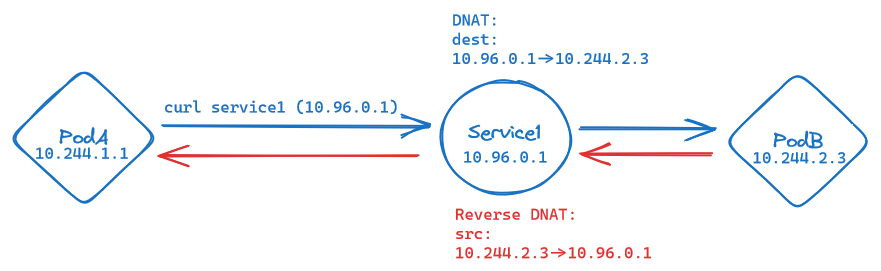

# ClusterIP

The simplest way to expose a service is to use a ClusterIP. This is the default service type and it exposes the service on a cluster-internal IP. Only pods within the cluster can access the service.

<figure markdown>
  
  <figcaption>ClusterIP traffic including DNAT-ing</figcaption>
</figure>

As we can see in the figure above, the `ClusterIP` service is exposed via a **virtual IP** in a dedicated **service subnet**.

Upon request by a client, the **service IP** gets DNAT-ed to the **pod IP** of one of the pods in the service. The pod is selected by the **service selector**. On the way back, the pod IP gets reverse DNAT-ed, back to the service IP.

## DNS Resolution

Another advantage of using `Services` instead of `Pods` is that `Services` get a **DNS entry** in the cluster-internal DNS server. This allows us to use the service name as a hostname in our applications.

<figure markdown>
  
  <figcaption>DNS resolution in Kubernetes - <code>.svc.</code> indicates the service domain to the DNS server</figcaption>
</figure>

With this DNS service in place, we can use the service name as a hostname in our applications. The DNS server will resolve the service name to the service IP. This is great, because it allows us to deploy microservices independent from one another - all that needs to be established is the **service name**.

## Creating services

Let's try and see for ourselves if all my claims hold true: we'll create a `ClusterIP` service for our nginx deployment and see if we can access it from within the cluster.

Once again, we can use an imperative cmdlet to create our service manifest:

```bash
mkdir networking
kubectl expose deployment nginx --port 80 --dry-run=client -o yaml > networking/nginx-clusterip.yaml
```

The manifest looks like this:

<div class="annotate" markdown>

```yaml
apiVersion: v1
kind: Service
metadata:
  creationTimestamp: null
  labels:
    app: nginx
  name: nginx
spec:
  ports:
  - port: 80 # (1)!
    protocol: TCP
    targetPort: 80
  selector: # (2)!
    app: nginx
status:
  loadBalancer: {}
```

</div>

1.  By default, `port` and `targetPort` are the same. This means that the service will forward traffic to port 80 on the pods.
2.  The service selector is the same as the deployment selector. This means that the service will select the same pods as the deployment.

Let's apply the manifest and take a look at the service and its detected endpoints:

```bash
kubectl apply -f networking/nginx-clusterip.yaml
kubectl get service,endpoints -l app=nginx
```

✅ Looking good! We can see our service with its virtual IP, the port it's listening on and the endpoints it has detected and will forward traffic to.

```bash
NAME            TYPE        CLUSTER-IP    EXTERNAL-IP   PORT(S)   AGE
service/nginx   ClusterIP   10.96.7.154   <none>        80/TCP    32m

NAME              ENDPOINTS       AGE
endpoints/nginx   10.244.2.2:80   32m
```

!!! abstract "Bonus task"
    Try to scale up the `nginx` deployment and check the endpoints again - you should see more entries for the `nginx` service. If you'd like, you can also display the pods' IP addresses and see if they match the endpoints.

*[NAT]: Network Address Translation
*[DNAT]: Destination Network Address Translation
*[SNAT]: Source Network Address Translation

