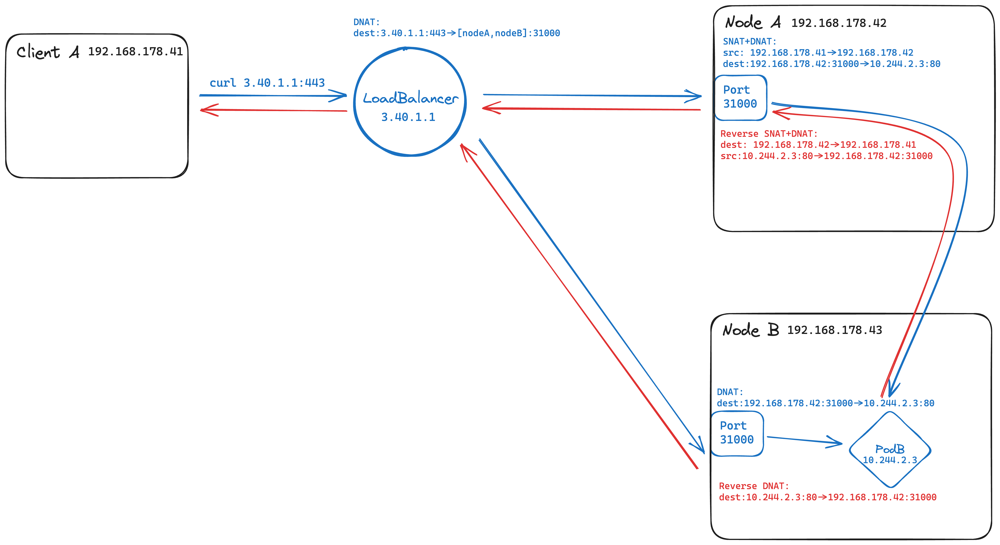

# LoadBalancer

In the last section, we managed to expose our `nginx` service to the outside world by using a `NodePort` service. However, this approach has a few drawbacks:

-  We need to know the IP address of one of the nodes in the cluster to access the service.
-  We need to know the port on which the service is exposed on the node.

This makes working with `NodePorts` cumbersome for most use cases - if a **node** is **in maintenance**, clients need to look up the **IP address** of **another node**. If we want to **expose multiple services**, we need to **keep track of the ports** on which they are exposed on the nodes.

This is why `LoadBalancer` services exist. They are a special type of service that is **exposed externally** via a **cloud provider's load balancer**. This load balancer will **route traffic** to the **nodes** in the cluster, which in turn will route the traffic to the **service**.

**Provisioning** and **configuration** of said external load balancer is done by the **cloud controller manager** upon creation of the service.

<figure markdown>
  
  <figcaption>LoadBalancer traffic, including different NAT-ing depending on the entered node (Click the image to zoom in)</figcaption>
</figure>

The figure above shows the traffic flow when accessing a `LoadBalancer` service. The traffic is routed through the **external load balancer** to one of the **nodes** in the cluster. The node then routes the traffic to the **service**. The service then routes the traffic to one of the **pods** in the service.

Summing up, `LoadBalancer` extend the capabilities of `NodePort` services by providing a **single point of entry** to the cluster - the traffic flow stays the same, compared to a `NodePort` service. This makes them ideal for **exposing services to the outside world**.

!!! info "Where's the lab?"
    As mentioned above, Kubernetes relies on the hosting cloud and the `cloud controller manager` to provision and configure the external load balancer. This means that we can't test `LoadBalancer` services in our lab environment without additional configuration that is be out of scope for this course.

    If you're interested in this topic, I recommend looking at the [MetalLB](https://metallb.universe.tf/) project. It provides a software load balancer implementation that can be used in lab environments or on bare metal clusters.
