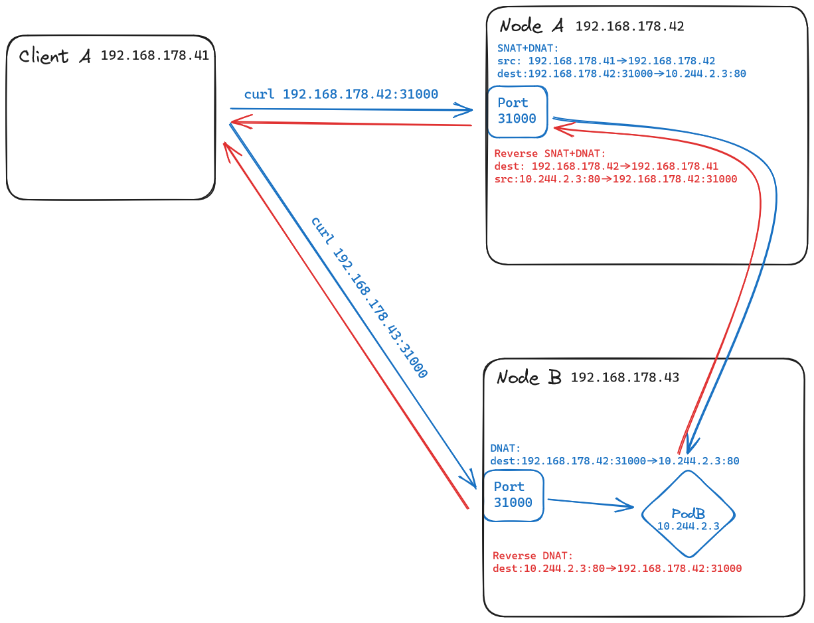

# NodePort

While we can get away with using `ClusterIP` services for internal communication between pods, we need a different type of service to expose our applications to the outside world, e.g. to a local office network, or even to the internet.

This is where `NodePort` services come in. They expose the service on a port on each node of the cluster. This allows external clients to access the service via `<NodeIP>:<NodePort>`. The `NodePort` is a port in the range `30000-32767` by default. We can specify a custom port in the service manifest.

<figure markdown>
  
  <figcaption>NodePort traffic, including different NAT-ing depending on the entered node</figcaption>
</figure>

!!! question "Where's the `Service`?"
    When connecting to a `NodePort` service from outside the cluster, i.e. via the port specified, the traffic is indeed routed through our service, and **not** directly to the pods.
    
    However, the NAT-ing happening behind the scenes makes it look like the traffic is routed directly to the pods. This is why the `Service` is not shown in the figure above.

    If you know your way around iptables, hop onto one of your nodes and have a look at the `nat` table. You'll see the `DNAT` and `SNAT` rules that make this possible. 😉

*[NAT]: Network Address Translation
*[DNAT]: Destination Network Address Translation
*[SNAT]: Source Network Address Translation